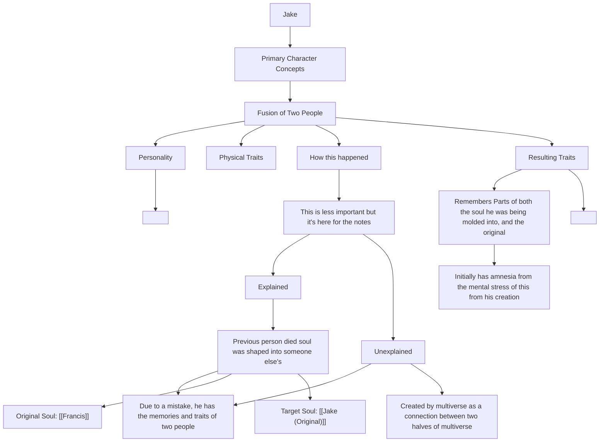

```mermaid
graph TB
33cf8fe3b743df3d["Jake"]
83cfbb738b91a6c5["Primary Character Concepts"]
6f5b3bcc3bafb493["Fusion of Two People"]
7b3de7c50cd1be4b["Personality"]
799893223be5dc09["Physical Traits"]
80a6f5632e093fc7[" "]
23b597e8e836de3b["How this happened"]
05a6487bd8ee6de1["This is less important but it's here for the notes"]
fdf035a0f5c4d122["Explained"]
f2c98e3278133dc1["Unexplained"]
92739e4d0ac3556b["Previous person died soul was shaped into someone else's"]
791964d9b67910ae["Resulting Traits"]
706031e59efaef23["Remembers Parts of both the soul he was being molded into, and the original"]
67933c9a2c8fa683["Initially has amnesia from the mental stress of this from his creation"]
7d16bbbd2ec15bcf["Due to a mistake, he has the memories and traits of two people"]
1c3da75c97765525["Created by multiverse as a connection between two halves of multiverse"]
c5effb9ab75b9593[" "]
249aa3d77caa5e85["Original Soul: [[Francis]]"]
3f84544f64e0ef7a["Target Soul: [[Jake (Original)]]"]
33cf8fe3b743df3d --> 83cfbb738b91a6c5
83cfbb738b91a6c5 --> 6f5b3bcc3bafb493
6f5b3bcc3bafb493 --> 7b3de7c50cd1be4b
6f5b3bcc3bafb493 --> 799893223be5dc09
7b3de7c50cd1be4b --> 80a6f5632e093fc7
6f5b3bcc3bafb493 --> 23b597e8e836de3b
23b597e8e836de3b --> 05a6487bd8ee6de1
05a6487bd8ee6de1 --> fdf035a0f5c4d122
05a6487bd8ee6de1 --> f2c98e3278133dc1
fdf035a0f5c4d122 --> 92739e4d0ac3556b
6f5b3bcc3bafb493 --> 791964d9b67910ae
791964d9b67910ae --> 706031e59efaef23
706031e59efaef23 --> 67933c9a2c8fa683
f2c98e3278133dc1 --> 7d16bbbd2ec15bcf
92739e4d0ac3556b --> 7d16bbbd2ec15bcf
f2c98e3278133dc1 --> 1c3da75c97765525
791964d9b67910ae --> c5effb9ab75b9593
92739e4d0ac3556b --> 249aa3d77caa5e85
92739e4d0ac3556b --> 3f84544f64e0ef7a

```