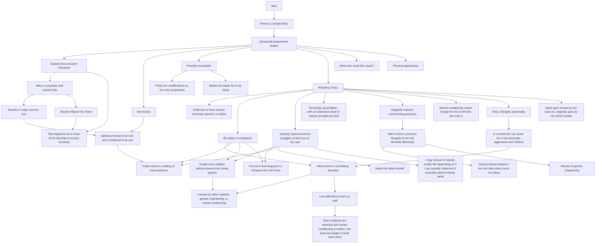

```mermaid
graph TB
1bcf73117880a9d7["Sam"]
cf16479dd3eed837["Primary Concept Ideas"]
414d86afe3feecb3["Genetically Engineered Soldier"]
3ba80077ff7162a0["Existed Since Ancient Humanity"]
35086ddeb27c93a4["Was in cryostasis until present day"]
656b87b22f860a51["Results in major memory loss"]
ff90a77a8a3a1fcb["Not human"]
c63c388f54764d90["Possibly Incomplete"]
80e0a3bc243459be["Finish her modifications as the story progresses"]
bbd60a9c05f53436["Parents Placed Her There"]
3b990e05305105bc["This happened as a result of the downfall of ancient humanity"]
2160576b84193276["Maybe this leads her to be dying"]
c68b2f09a6b7967f["What else could this cause?"]
34ceec53b4f4f527["Forced to feel longing for a romance she can't have"]
f9842800f677158a["Create more soldiers without trauma from losing partner"]
3b8d77a59a5819f3["More prone to committing atrocities "]
47ac25b0e668b1be["Less affected by them as well"]
c1dbc8dc69f4c635["When implants are removed and mental conditioning is broken, she feels the weight of what she's done"]
9cbfec7e605bed58["Helps result in a feeling of true loneliness"]
9bb1d18216f9976c["Believes herself to be one and is believed to be one"]
a08627a25b136646["Resulting Traits:"]
a8463ed25d18b127["Magically induced commanding presence"]
637ecf675591de15["Mental conditioning makes it tough for her to tell who she truly is"]
a9f06ecc840c6e94["Terrifyingly good fighter, with an impressive level of natural strength and skill"]
5c7c77c86dc793a6["Iffy ability to emphasize"]
de73df0455599891["Able to bend a person's thoughts to her will decently effectively"]
e00fdd90b08274cd["Causes tension between her and Jake when found out about"]
9d352fb5fad3a19a["Results of genetic engineering"]
b25619875155d93c["Reflective of what ancient humanity valued in a soldier"]
accd99e41eb3ceb2["Hates this about herself"]
895810daeb7472b5["Caused by either implants, genetic engineering, or mental conditioning"]
c97468ecb7545944["Typically hypersexual but struggles to feel love on her own"]
0975143b18b1b2bb["Fiery, energetic personality"]
76a403c6e39bdc74["In combat this can cause her to be extremely aggressive and ruthless"]
07de60fcceede205["Physical appearance "]
81a40feee45894d9["Name gets chosen by her early on, originally goes by her serial number"]
903e8ae4458d8a2d["I may remove or heavily modify this depending on if I can actually implement it smoothly without feeling weird"]
1bcf73117880a9d7 --> cf16479dd3eed837
cf16479dd3eed837 --> 414d86afe3feecb3
414d86afe3feecb3 --> 3ba80077ff7162a0
3ba80077ff7162a0 --> 35086ddeb27c93a4
35086ddeb27c93a4 --> 656b87b22f860a51
414d86afe3feecb3 --> ff90a77a8a3a1fcb
ff90a77a8a3a1fcb --> 9bb1d18216f9976c
656b87b22f860a51 --> 9bb1d18216f9976c
414d86afe3feecb3 --> c63c388f54764d90
c63c388f54764d90 --> 80e0a3bc243459be
35086ddeb27c93a4 --> bbd60a9c05f53436
bbd60a9c05f53436 --> 3b990e05305105bc
3ba80077ff7162a0 --> 3b990e05305105bc
414d86afe3feecb3 --> a08627a25b136646
a08627a25b136646 --> b25619875155d93c
c63c388f54764d90 --> 2160576b84193276
a08627a25b136646 --> 5c7c77c86dc793a6
a08627a25b136646 --> c97468ecb7545944
c97468ecb7545944 --> f9842800f677158a
a08627a25b136646 --> a9f06ecc840c6e94
5c7c77c86dc793a6 --> 3b8d77a59a5819f3
3b8d77a59a5819f3 --> 895810daeb7472b5
f9842800f677158a --> 895810daeb7472b5
c97468ecb7545944 --> 34ceec53b4f4f527
5c7c77c86dc793a6 --> 9cbfec7e605bed58
c97468ecb7545944 --> 9cbfec7e605bed58
9bb1d18216f9976c --> 9cbfec7e605bed58
3b8d77a59a5819f3 --> 47ac25b0e668b1be
414d86afe3feecb3 --> c68b2f09a6b7967f
414d86afe3feecb3 --> 07de60fcceede205
c97468ecb7545944 --> accd99e41eb3ceb2
47ac25b0e668b1be --> c1dbc8dc69f4c635
a08627a25b136646 --> a8463ed25d18b127
a8463ed25d18b127 --> de73df0455599891
de73df0455599891 --> e00fdd90b08274cd
de73df0455599891 --> 9d352fb5fad3a19a
a08627a25b136646 --> 637ecf675591de15
a08627a25b136646 --> 0975143b18b1b2bb
0975143b18b1b2bb --> 76a403c6e39bdc74
a08627a25b136646 --> 81a40feee45894d9
c97468ecb7545944 --> 903e8ae4458d8a2d
5c7c77c86dc793a6 --> f9842800f677158a
5c7c77c86dc793a6 --> 34ceec53b4f4f527
76a403c6e39bdc74 --> 3b8d77a59a5819f3

```