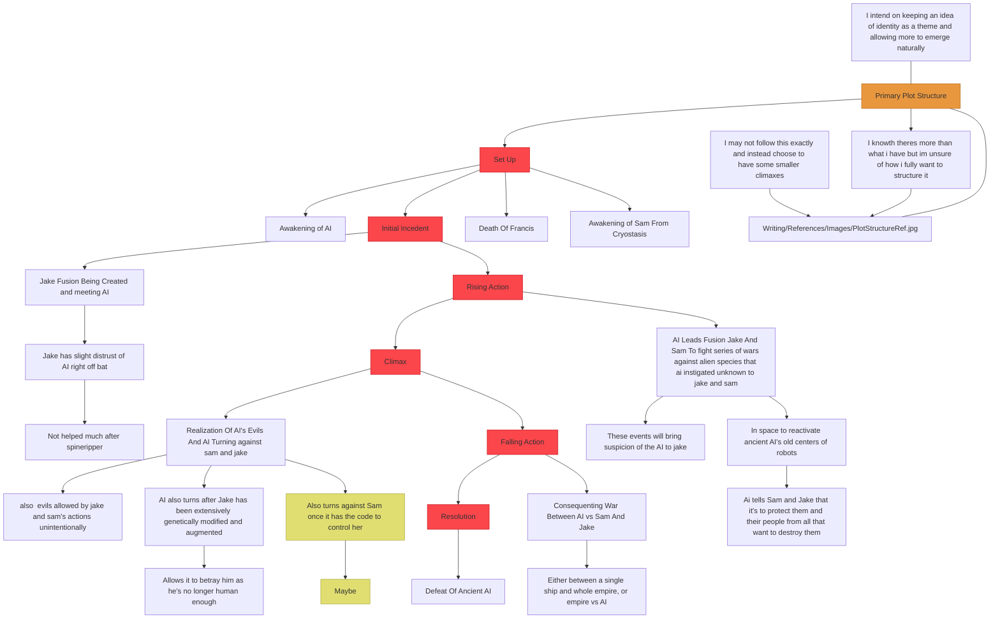

```mermaid
graph TB
ba940d36955e632f["Primary Plot Structure"]
685239c6f3375095["Jake Fusion Being Created and meeting AI"]
f78fc4a907e9f93b["Initial Incedent"]
cb93b76bb4c5776b["Awakening of AI"]
f47d080ce60c26d3["Set Up"]
facbd83dad482549["Death Of Francis"]
9239e255b6c9992a["Awakening of Sam From Cryostasis"]
ffecd3dd47690f22["Writing/References/Images/PlotStructureRef.jpg"]
52616bfed7546d43["Either between a single ship and whole empire, or empire vs AI"]
73edb8cda884bb5c["Rising Action"]
079b375615e0c96f["Jake has slight distrust of AI right off bat"]
8f4f11d5daa08a60["Not helped much after spineripper"]
e8626bf63fc501d8["These events will bring suspicion of the AI to jake"]
c239c53abc6dc525["AI Leads Fusion Jake And Sam To fight series of wars against alien species that ai instigated unknown to jake and sam"]
ffa161b5e8fd3a4c["also  evils allowed by jake and sam's actions unintentionally"]
0d873b9bd7753ab9["Realization Of AI's Evils And AI Turning against sam and jake"]
7fda9df530d6f6d0["I intend on keeping an idea of identity as a theme and allowing more to emerge naturally"]
f843681c71da541b["I may not follow this exactly and instead choose to have some smaller climaxes"]
d6014ee7571c7ca0["I knowth theres more than what i have but im unsure of how i fully want to structure it"]
397fecbd79682ced["Resolution"]
e1f751e983fe4219["Defeat Of  Ancient AI"]
6e8f8e1f4f71e91b["In space to reactivate ancient AI's old centers of robots"]
092c9460c0ab9bdc["Ai tells Sam and Jake that it's to protect them and their people from all that want to destroy them"]
e87ebc3ed3622f17["Also turns against Sam once it has the code to control her"]
4b2e8da44e4217dc["Maybe"]
6298c01c75951cbc["Climax"]
f3920d76d798ccf5["Falling Action"]
94525ea626ffaece["Consequenting War Between AI vs Sam And Jake"]
a5312a7b9075d6b2["AI also turns after Jake has been extensively genetically modified and augmented"]
b78554bb5d261dda["Allows it to betray him as he's no longer human enough"]
ffecd3dd47690f22 --- ba940d36955e632f
7fda9df530d6f6d0 --- ba940d36955e632f
ba940d36955e632f --> f47d080ce60c26d3
6298c01c75951cbc --> 0d873b9bd7753ab9
f47d080ce60c26d3 --> cb93b76bb4c5776b
ba940d36955e632f --> d6014ee7571c7ca0
d6014ee7571c7ca0 --> ffecd3dd47690f22
f47d080ce60c26d3 --> f78fc4a907e9f93b
f78fc4a907e9f93b --> 685239c6f3375095
f843681c71da541b --> ffecd3dd47690f22
f78fc4a907e9f93b --> 73edb8cda884bb5c
73edb8cda884bb5c --> 6298c01c75951cbc
6298c01c75951cbc --> f3920d76d798ccf5
f3920d76d798ccf5 --> 397fecbd79682ced
73edb8cda884bb5c --> c239c53abc6dc525
f47d080ce60c26d3 --> facbd83dad482549
f47d080ce60c26d3 --> 9239e255b6c9992a
0d873b9bd7753ab9 --> ffa161b5e8fd3a4c
c239c53abc6dc525 --> e8626bf63fc501d8
f3920d76d798ccf5 --> 94525ea626ffaece
94525ea626ffaece --> 52616bfed7546d43
397fecbd79682ced --> e1f751e983fe4219
c239c53abc6dc525 --> 6e8f8e1f4f71e91b
6e8f8e1f4f71e91b --> 092c9460c0ab9bdc
0d873b9bd7753ab9 --> a5312a7b9075d6b2
a5312a7b9075d6b2 --> b78554bb5d261dda
685239c6f3375095 --> 079b375615e0c96f
079b375615e0c96f --> 8f4f11d5daa08a60
0d873b9bd7753ab9 --> e87ebc3ed3622f17
e87ebc3ed3622f17 --> 4b2e8da44e4217dc
style ba940d36955e632f fill:#e9973f, stroke:#b6640c
style f78fc4a907e9f93b fill:#fb464c, stroke:#c81319
style f47d080ce60c26d3 fill:#fb464c, stroke:#c81319
style 73edb8cda884bb5c fill:#fb464c, stroke:#c81319
style 397fecbd79682ced fill:#fb464c, stroke:#c81319
style e87ebc3ed3622f17 fill:#e0de71, stroke:#adab3e
style 4b2e8da44e4217dc fill:#e0de71, stroke:#adab3e
style 6298c01c75951cbc fill:#fb464c, stroke:#c81319
style f3920d76d798ccf5 fill:#fb464c, stroke:#c81319

```
